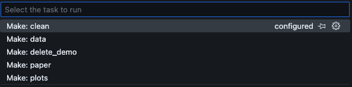

# Cookiecutter for Science Projects

A cookiecutter template for science and data science projects that include data, code, and dissemination.

- Optimized for data-based publications
- Optimized for use with VS Code
- Docker-based, version-controlled environment using VS Code Dev Containers
- conda based environment inside the Dev Container - just add packages to envrionment.yml and rebuild. Same environment for the whole team
- use of Dev container Features with pre-installed, Python, oh-my-zsh and LaTeX
- Optimised for use with Python but could also be used with Julia, and R
- Make commands for: collecting data, generating, figures, typsetting latex, clean temp files, clean demo files
- use of VS Code tasks to trigger data collection, plotting and paper compilation
- LaTeX-based paper
- Added path definitions in the `project_package` Python module
- Kedro-inspired data folder structure
- filled with a demo - which can be cleaned with "make delete_demo"
- used in at least [5 papers](https://www.researchgate.net/profile/Thomas-Goelles)

For more detailed information, please see the [README of the resulting project](./%7B%7B%20cookiecutter.repo_name%20%7D%7D/README.md).

## Quick Start

```bash
cookiecutter https://github.com/tgoelles/cookiecutter_science
```

## File Structure

```
├── .devcontainer                      # Definition of the Docker container and environment for VS Code
│   ├── Dockerfile                     # Defines the Docker container
│   ├── devcontainer.json              # Defines the devcontainer settings for VS Code
│   └── noop.txt                       # Placeholder file to ensure the COPY instruction does not fail if no environment.yml exists
├── .gitattributes                     # Git attributes for handling line endings and merge strategies
├── .gitignore                         # Git ignore file to exclude files and directories from version control
├── Makefile                           # Makefile with commands like `make data` and `make clean`
├── README.md                          # Project readme
├── code                               # Source code and notebooks
│   ├── notebooks                      # Jupyter notebooks
│   │   └── exploratory                # Data explorations
│   │       └── 1.0-tg-example.ipynb   # Jupyter notebook with naming conventions. tg are initials
│   ├── project_package                # Project-specific Python package
│   │   ├── __init__.py                # Makes project_package a Python module
│   │   ├── data                       # Scripts to download, generate and parse data
│   │   │   ├── __init__.py
│   │   │   ├── config.py              # Project-wide path definitions
│   │   │   ├── example.py             # Example script
│   │   │   ├── import_data.py         # Functions to read raw data
│   │   │   └── make_dataset.py        # Scripts to download or generate data (used in the Makefile)
│   │   ├── tools                      # Scripts and functions for general use
│   │   │   ├── __init__.py
│   │   │   └── convert_latex.py       # Functions to convert elements for use in LaTeX
│   │   └── visualization              # Scripts and functions to create visualizations
│   │       ├── __init__.py
│   │       ├── make_plots.py          # Scripts to make all plots for the publication
│   │       └── visualize.py           # Functions to produce final plots
│   └── pyproject.toml                 # Configuration file for the project
├── data                               # Data directories
│   ├── 01_raw                         # The original, immutable data dump
│   │   └── demo.csv                   # Example raw data file
│   ├── 02_intermediate                # Optional data model(s) to type your raw data model(s)
│   ├── 03_primary                     # Domain-specific data model(s) containing cleansed data
│   ├── 04_feature                     # Analytics-specific data model(s) containing a set of features defined against the primary data
│   ├── 05_model_input                 # Analytics-specific data model(s) containing all feature data against a common dimension
│   ├── 06_models                      # Stored, serialized pre-trained machine learning models
│   ├── 07_model_output                # Output from trained machine learning models
│   └── 08_reporting                   # Reporting data model(s) used to combine primary, feature, model input, and model output data
├── dissemination                      # Materials for dissemination
│   ├── figures                        # Figures for paper generated with Python
│   │   └── demo.png                   # Example figure file
│   ├── presentations                  # All related PowerPoint files, especially for deliverables
│   └── papers                         # LaTeX-based papers
│       └── minimal.tex                # Example LaTeX paper
├── environment.yml                    # Conda environment configuration file
└── literature                         # References and explanatory materials
    └── references.bib                 # Bibliography file for LaTeX documents
```

## Tasks

Use of VS Code tasks:



## Requirements

- **Git**: Should be part of your OS or install it [here](https://github.com/git-guides/install-git)
- **GitHub account**
- **GitHub CLI**: Install from [here](https://cli.github.com/)
- **Docker Desktop**: Install from [here](https://www.docker.com/products/docker-desktop/)
- **VS Code**: Install from [here](https://code.visualstudio.com/)
- **VS Code Extension: Remote Development**: Install from [here](https://marketplace.visualstudio.com/items?itemName=ms-vscode-remote.vscode-remote-extensionpack)
- **Cookiecutter Python package**: Install like this:

```bash
pip install cookiecutter
```

For Mac users:

```bash
brew install cookiecutter
```

## Getting Started

1. Navigate to the folder where you want to create the project (on your local drive):

   ```bash
   cookiecutter https://github.com/tgoelles/cookiecutter_science
   ```

2. Answer the questions prompted by cookiecutter.
3. A new VS Code window will open automatically.
4. Click "OK" to reopen the folder in a container (only asked the first time).
5. Read the README.md in the generated project folder.

## Git and GitHub

Cookiecutter can generate a GitHub repository for you. This initializes the git repo and pushes it to GitHub. You can then invite your team members to join the project.

- Each team member works on their local version of the project, regularly committing and pushing changes.
- Avoid working on the same folder over a network.

### Note for Windows Users

If you want to use git inside the container (recommended), you need to clone the repo from WSL, as Windows may mess up the `.git` folder. Git inside the container uses the same `.gitconfig` as Windows, which is copied into the container.

Ensure `user.email` and `user.name` are set (in PowerShell):

```bash
git config --global user.name "your_name"
git config --global user.email "your_email@gmail.com"
```
